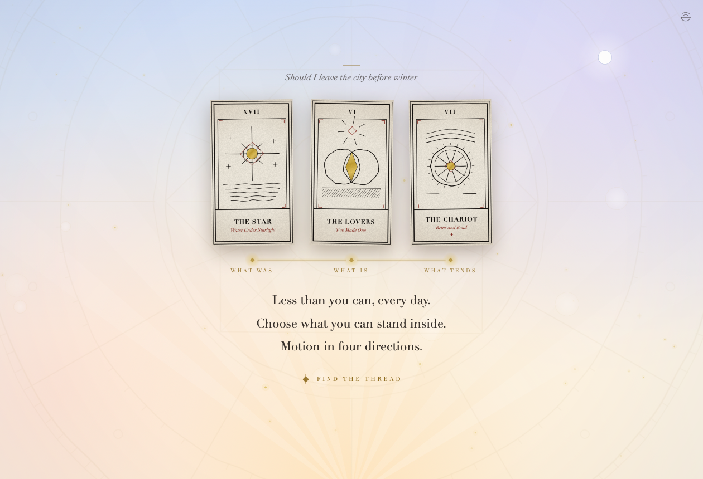

# Arcana

A tarot reading room for macOS. Native SwiftUI, no dependencies — every card is
drawn by code and every sound is synthesised at launch.



```bash
./build.sh && open build/Arcana.app
```

A reading is a small crossing. You arrive in the sky at first light — pale
blue overhead, dawn rising from below the table, tonight's real moon still up
in the corner. You ask by holding: the room goes quiet, gold dust gathers to
the deck, the drone swells, and on the last breath the deck is cut. If you
wrote your question first, its gold goes in with the dust, and it comes back
above the spread before the verse answers it. Each card
you draw writes itself in gold that cools to ink and rings its own bowl; a
thread of light is laid beneath the spread as it grows. Then the reading is
spoken back as verse, one line per card, and the whole spread sounds as one
chord. When it is over you hold once more, and the cards are returned: the ink
sinks into the stock, the gold stays, and they go home to the deck.

Four of the cards are already in the sky — the Wheel, the Star, the Moon and
the Sun — and when one of them is drawn, the sky answers it once the card has
written itself. The engraved wheel turns a house. The stars come out in the
day sky, one by one. Tonight's moon lets its half-light out over the room, as
far as it is really lit: at the full, the whole room; at the new moon, almost
nothing. First light rises into morning, and the rays reach further. Reversed,
each answers the way its line reads: the wheel turns and comes back, one star
at a time comes out and goes in again, the lilac clears off the sky, the light
comes up white. An answer stays while its card lies on the table, and goes
with the card's ink when the cards are returned.

## Playing

| | |
|---|---|
| `1` `2` `3` | choose a spread — one card, three fates, the long road. Once you are writing, they are only numbers |
| type | before you hold, you may write the question. It is laid in gold and cools to ink; the hold gives it to the deck as dust, and it is read back above the spread. It is kept nowhere and sent nowhere |
| press and hold | anywhere on the sky, or hold `space` / `return` — asks the question and cuts the deck. While writing, a tapped `space` is a space. Let go early and the light drains back |
| sweep the hand | the fan is an instrument: each card chimes as the cursor crosses it, low on the left, high on the right |
| click a card | draw it; it lands, turns, and writes itself |
| hover a drawn card | its line brightens in the verse, its light and node rise |
| click a drawn card | opens it on the altar — it turns toward the pointer |
| press and hold, again | press and hold the sky, or hold `space` / `return`, once the reading has been spoken: return the cards |
| `esc` | let go / take back what you wrote / close the card / start over |
| `m` | sound on/off. Before the ask it is a letter; the bowl, top right, always works |

Cards land reversed about 42% of the time; the art turns with them, an oxblood
diamond appears under the title, and the card's bowl sounds an octave lower in
a darker voice.

With Reduce Motion on, the hold is short, cards appear already written, and the
sky is still. It still answers its cards, in a moment and by fading; the wheel
does not turn, the turned wheel fades in over it.

When a spread is complete, **find the thread** is an optional closing ritual,
offered only when Arcana has a key to find it with (below); without one, the
reading ends on the verse.
It returns one finished folio with two short sentences and one question to carry
away, set in the air where the verse was. When the cards are returned, its
question stays over the blank cards until they turn. It never streams or opens a
chat. The request sends only the selected spread and Arcana's authored card
language. A question you write is never part of that request.

To enable it locally, put an OpenAI key in `.env.local`:

```text
OPENAI_API_KEY=your-key-here
```

`ARCANA_AI_MODEL` is optional and defaults to `gpt-5`. The app requests a
structured result with `store: false` and keeps the folio only in the current
reading.

## How it is built

| file | |
|---|---|
| `Sources/Arcana/Ink.swift` | a pen that draws like a hand — every stroke bowed, every vertex nudged by a seeded generator, so a card is identical each run but never mechanical |
| `Sources/Arcana/CardArt.swift` | the twenty-two compositions, the card frame, the blind-embossed reverse with its one sun of gold leaf, the celestial wheel, the app icon; and what each card leaves in the stock when its ink has sunk |
| `Sources/Arcana/Deck.swift` | the deck. One line per card, per orientation; one note per position |
| `Sources/Arcana/CardImages.swift` | faces rasterised once via `ImageRenderer`; a card being revealed is drawn live, stroke by stroke, then swapped for its raster. A card being returned is its raster fading off its pressed blank — the same grammar as the reverse: stock, pressed lines, one gold |
| `Sources/Arcana/Chamber.swift` | the sky at first light: pale blue, lilac, rose, dawn and its rays, the engraved wheel, the daytime moon, and the near sky — gold dust and soft blooms that breathe, glints, the hold ring, blooms and ripples |
| `Sources/Arcana/SkyRenderer.swift` | the near sky on the GPU: each frame a short list of soft shapes — discs, glows, rings, the charge's arc, the glints' fine arms of light — drawn by one small Metal shader on a display link of its own; the shot tool gets the same frame as a still |
| `Sources/Arcana/Answers.swift` | as above: the four cards the sky already holds, and how it answers each — the lights it lays over itself for the Moon and the Sun, and the wheel's turn, all carried by Core Animation; the stars are the near sky's own glints, held |
| `Sources/Arcana/Moon.swift` | tonight's moon phase, reckoned from a known new moon, and its face: the near side's seas, walled plains and rayed craters where they really lie, a day moon: pearl where the sun is on it, the seas a lilac veil of sky, the rest a ghost of the disc — painted once per phase, pixel by pixel |
| `Sources/Arcana/Sfx.swift` | singing bowls, chimes, the swell, a drone that breathes with the sky, and the hand sounds — synthesised off the main thread at launch, played through two rooms |
| `Assets/arcana-logo.png` | the compass/eclipse mark used for the macOS app icon |
| `Sources/Arcana/Game.swift` | the beats — the held question, the draw, the writing, the recital, the return — plus all stage geometry |
| `Sources/Arcana/RootView.swift` | the table itself: one absolutely-positioned stage, the thread, the verse, the altar |
| `Sources/Arcana/Weave.swift` | the optional, non-streaming spread thread provider |
| `Sources/Arcana/Quill.swift` | the written question — laid by the pen in gold, cooling to ink, given to the deck with the dust, read back above the spread; held in memory only |
| `Sources/Arcana/QuillInput.swift` | the invisible page it is typed on — a real text view, so accents, dead keys and input methods work, with nothing drawn |

Type is Didot throughout, which ships with macOS.

### Sound

Every position in a spread has a note from one C-major pentatonic, so any spread
is a consonant chord. The drone loops every twenty seconds without a seam —
each partial completes a whole number of cycles — and swells on a ten-second
period, started in phase with the sky's breathing, so light and sound breathe
together at six breaths a minute. Bowls, chimes and the swell go through a
cathedral reverb; card stock stays in a small room.

### Smooth, and quiet on the CPU

SwiftUI re-renders whatever a clock touches, so the rule here is: large
things never move by themselves. The sky's gradients, rays and wheel are
drawn once and change only while the question is held. The near sky — the
dust, the blooms, the glints, the ring and the ripples — is not drawn by
SwiftUI at all: for each frame it is reckoned as a short list of soft shapes
and drawn by one small Metal shader (`SkyRenderer.swift`), at 60fps while the
room only breathes and at the display's full rate (120fps on ProMotion) while
the question is held or light goes out across the sky. The frame is handed to
the display off the main thread, so nothing on the table waits for it. When
the sky answers a card, SwiftUI draws nothing new either: the lights laid over
the sky and the wheel's turn are handed to Core Animation whole, so an answer
that takes a breath costs the main thread nothing while it comes — here a
single SwiftUI pass, however small, costs more than a frame of the near sky,
and a fade driven by a SwiftUI clock would have cost 6–7% of a core. What
else moves on its own lives in small leaf views with clocks of their own — the
title's light at 60fps only during its sweep, the thread at the display's rate
only while light runs along it, the altar's words at 60fps while they rise, the
written line only while its ink is wet. The cards' halos flare by fading, never
by being repainted. When no one can see the room — the window covered,
minimised or hidden, the screens asleep — every clock rests and the audio
engine stops; muting stops it too. Everything is reckoned from the time, so it
all resumes in step. When the cards are returned, each redraws only while its
own ink is sinking, and nothing in the sky is redrawn — what it answered is
given back by Core Animation, in step with the ink — so a return costs less
than the ask. Idle, the app sits around 9–10% of one core — less than the 11–12% it
took when SwiftUI drew the sky at a third of the rate.

### Reviewing the look without a display

`./rebuild-shots.sh` renders posed frames of every phase — including a card
mid-writing, the question mid-hold, and the sky answering each of its four
cards either way up — to `build/shots/`, useful for judging layout in a diff,
or when the screen is not available. Name some to render only those:
`./rebuild-shots.sh 35 37` renders the Moon and the Sun.

### Notes

* `build.sh` compiles with `swiftc` straight into a signed `.app` bundle,
  packages the logo as `AppIcon.icns`, and needs only the Command Line Tools —
  no Xcode project.
* `_original/` holds the sources, a build and renders of the version before the
  redesign, for comparison.
